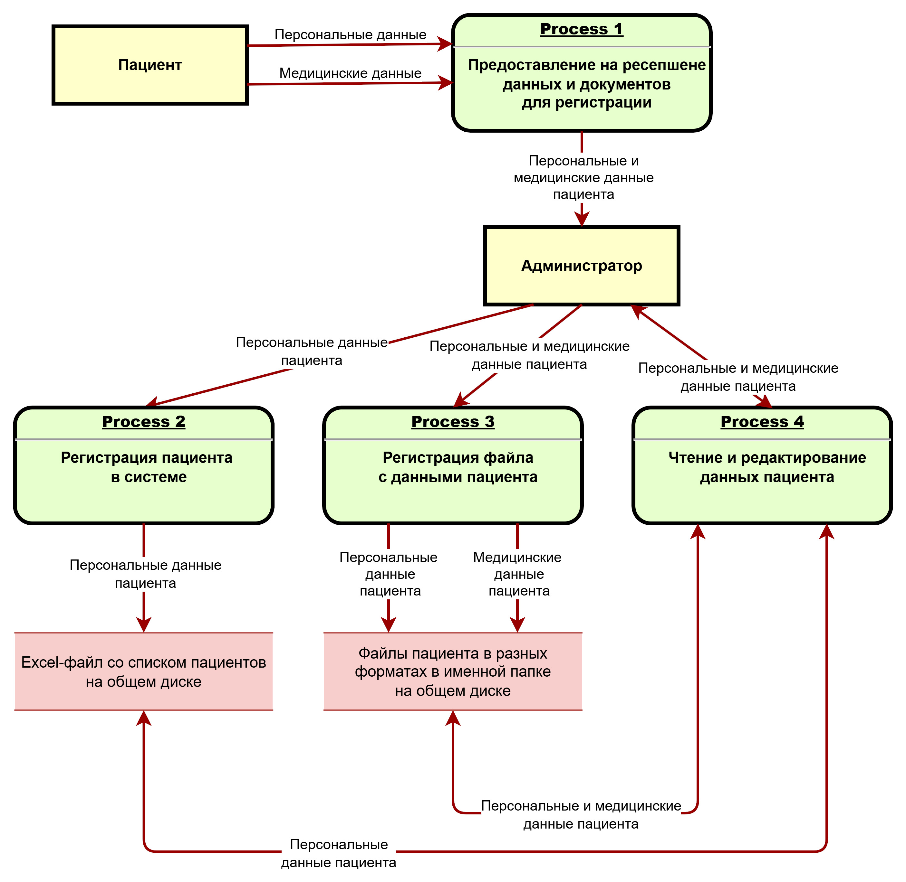
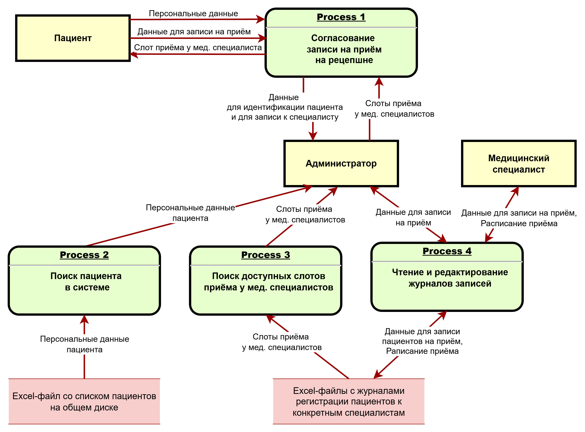
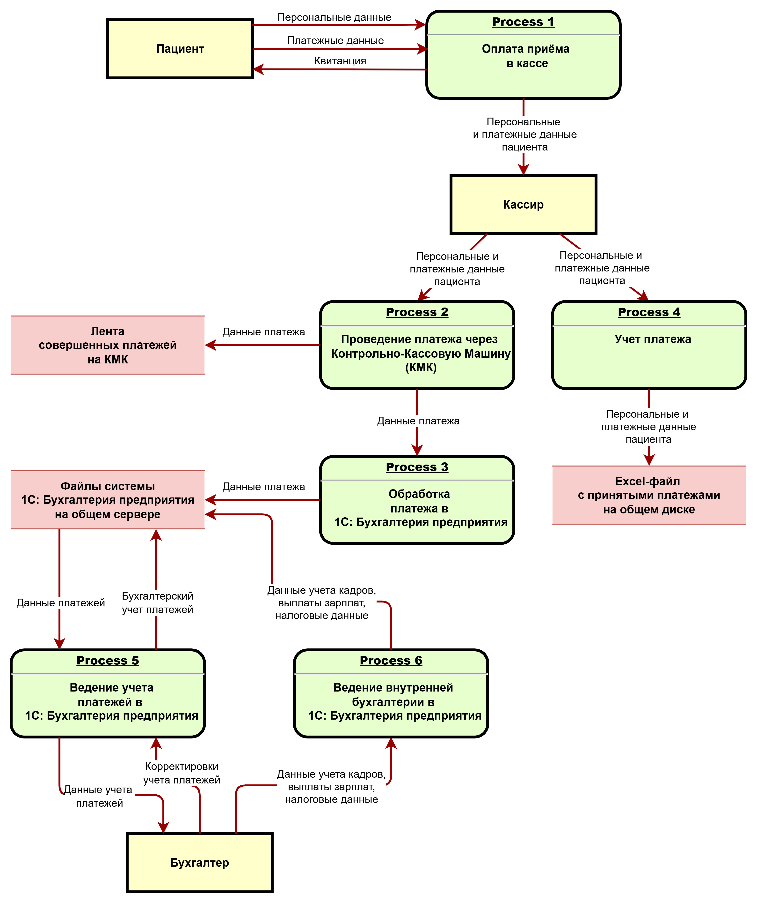
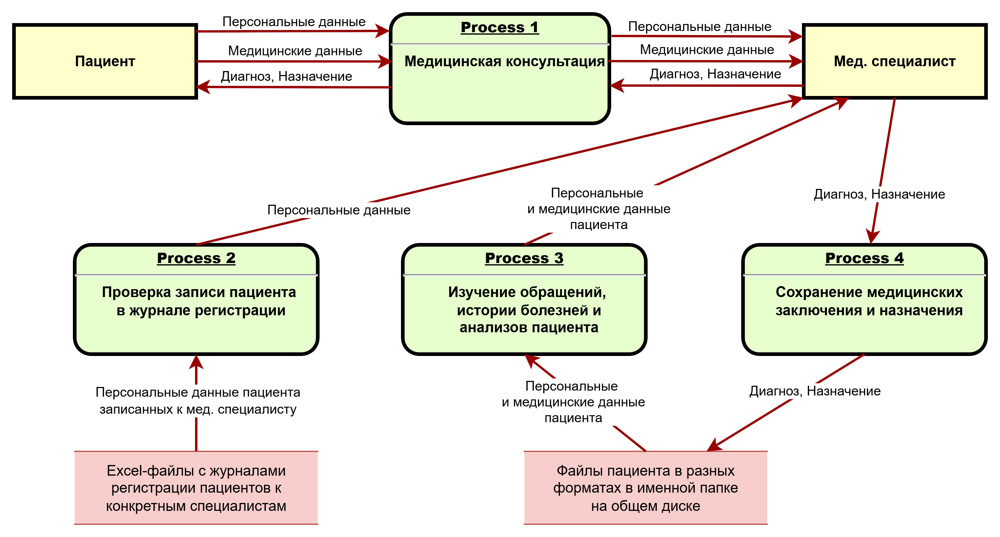
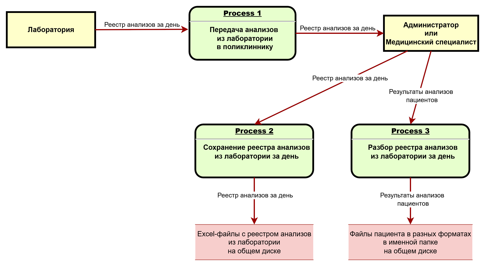
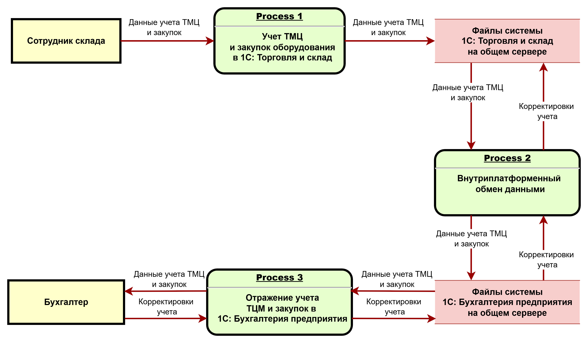

# architecture-medikamente
## Task 1. Список проблем компании в разрезе работы с данными и диаграммы потоков данных
### Текущая ситуация
#### Классы данных
1. **Перс. данные**
    - Ф.И.О.
    - Дата рождения
    - Телефон
    - Электронная почта
    - Адрес прописки
    - Место работы или учёбы
2. **Медицинские данные**
    - Хронические заболевания
    - Результаты анализов
    - Результаты консультаций и диагнозы
3. **Финансовые данные**
    - История операций
    - Платёжные реквизиты
    - Зарплаты
4. **Данные сотрудников**
    - Учётные данные
    - Логи аутентификации
#### Хранилища, процессы и источники данных:
1. **Excel (вручную, на компьютерах в локальной сети)**
    1. Учёт пациентов (Ресепшен, 3 чел - контракты)
    2. Ведение журналов приёма пациентов (Ресепшен, 3 чел - запись к Медицинским специалистам, 15 чел)
    3. Учёт платежей (Кассиры , 3 чел - прием платеже)
    4. Медицинские карты
    5. Учёт анализов
2. **1С:Бухгалтерия предприятия (на компьютерах в локальной сети, в файловом режиме). Интеграция с контрольно-кассовыми машинами (ККМ) (ККМ связаны с сервером через TCP/IP и компоненту 1С по технологии OLE)**
    1. Учет денежных средств (Кассиры , 3 чел - прием платеже; Бухгалтерия, 3 чел - процессинг платежей и бухгалтерия, связанная с учётом кадров, выплатой зарплат и налогами)
3. **1С:Торговля и склад (на компьютерах в локальной сети, в файловом режиме). Интеграция с 1С:Бухгалтерия предприятия**
    1. Учёт товарно-материальных ценностей (ТМЦ) (Склад, 3 чел - учёт ТМЦ и закупок оборудования для медицинских кабинетов)
4. **Outlook (на компьютерах в локальной сети)**
    1. Может быть что угодно.
5. **Сервер AD, DNS, DHCP, LDAP, файловый сервер, Exchange Mail Server**
    1. Один физический, на Windows Server 2022
    2. Находится в том же здании, что и офис (возможен несанкционированный физический доступ)
#### Дополнительная информация
1. Отсутствие ролевых моделей для разграничения работы с системами
    - Администратор сети может всё
    - Технический директор как будто бы тоже может всё
    - Ограничения по передаваемым данным обусловлены только бизнес-процессами компании
2. Нет ограничений и аудита доступа к данным
    - Бизнес-аналитик строит отчеты на основе Excel
    - Все файлы в общих шарах
    - Результаты работы с данными сохраняются и читаются в файлах и IT-системах без аудита действий
    - Со стороны систем обработки нет ограничений на доступ к данным кроме доменной аутентификации
    - Внутренние потоки данных между IT-продуктами никак не контролируются
#### DFD основных процессов
##### 1.1. Учет пациентов
[1.1.Учет-пациентов.drawio](Task1/1.1.Учет-пациентов.drawio)

##### 1.2. Ведение журналов записи пациентов
[1.2.Ведение-журналов-записи-пациентов.drawio](Task1/1.2.Ведение-журналов-записи-пациентов.drawio)

##### 1.3. Приём и учет платежей и бухгалтерия
[1.3.Приём-и-учет-платежей-и-бухгалтерия.drawio](Task1/1.3.Приём-и-учет-платежей-и-бухгалтерия.drawio)

##### 1.4. Приём пациента у мед. специалиста
[1.4.Приём-у-мед-специалиста.drawio](Task1/1.4.Приём-у-мед-специалиста.drawio)

##### 1.5. Учет анализов
[1.5.Учет-анализов.drawio](Task1/1.5.Учет-анализов.drawio)

##### 1.6. Учет ТМЦ
[1.6.Учет-ТМЦ.drawio](Task1/1.6.Учет-ТМЦ.drawio)

## Task 2 Диаграмма контекста в модели C4 c проектом архитектуры MVP
## Task 3 Таблица с классификацией данных, обоснованием необходимости защиты выделенных классов и инструментами защиты данных
## Task 4 Диаграмма Исикавы в draw.io
