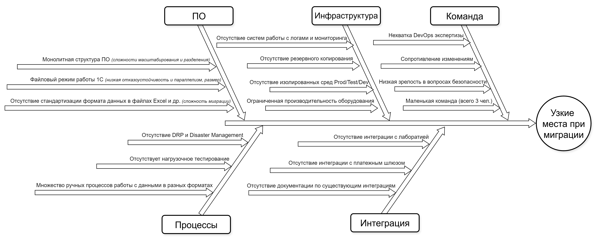

### Меры по устранению выявленных узких мест
## Диаграмма Исикавы
[ishikawa.drawio](ishikawa.drawio)

**Проблемы инфраструктуры, критичность высокая**

| Проблема                   | Решение                  | Приоритет |
|----------------------------|--------------------------|-----------|
|риск некорректной оценки ресурсов для масштабирования, связанный с отсутствие систем работы с логами и мониторинга| внедрение системы работы с логами (ELK стек) и мониторинга (grafana)|высокий|
|риск потери данных при миграции из-за отсутствия систем резервирования|настройка резервного копирования данных|высокий|
|риск неработоспособности нового решения из-за нехватки производительности оборудования или утилизации производительности процессами тестирования/разработки|1. использование облачных решений для масштабируемости и отказоустойчивости 2. настройка изолированных контуров Test и Dev  3. обновление сетевой инфраструктуры   4. автоматизация CI/CD|1. высокий 2. высокий 3. средний br />4. высокий |

**Проблемы ПО, критичность высокая**

| Проблема                   | Решение                  | Приоритет |
|----------------------------|--------------------------|-----------|
|cложность миграции c монолита, его масштабирования, а также переиспользования его функционала в новых решениях | формирование дорожной карты миграции с использованием паттерна Strangler Fig, а также внедрение фича-флагов, канареечных релизов для аккуратного внедрения и быстрого отката|высокий|
|текущие данные хранятся в разных форматах и не стандартизированы, что может привести к проблемам при миграции данных в новые системы|1.подготовить документацию с ожидаемым форматом текущих данных 2. Привлечь доп. штат в защищенном контуре (RDP, DLP) компании для AI и ручной валидации и корректировки данных 3. использование ETL (apache nifi) для миграции с валидацией|высокий|

**Проблемы Процессов, критичность высокая**

| Проблема                   | Решение                  | Приоритет |
|----------------------------|--------------------------|-----------|
|множество ручных процессов работы с данными в разных форматах|приоритетное внедрение цифрового документооборота, CRM и автоматизированных рабочих мест|высокий|
|риск долгого устранения инцидентов в процессе миграции из-за отсутствия практик DRP|обучение, разработка DRP и отработка на учебных сбоях|высокий|
|риск неработоспособности новых сервисов из-за отсутствия нагрузочного тестирования и неправильной оценки ресурсов|обучение|высокий|

**Проблемы Персонала, критичность средне-высокая**

| Проблема                   | Решение                  | Приоритет |
|----------------------------|--------------------------|-----------|
|отсутствие экспертизы в области DevOps и безопасности|1. тренингов, найм новых специалистов, постепенный переход с поддержкой внешних подрядчиков 2. всевозможная автоматизация для минимизации привлечение нехватающих специалистов 2. использование AI-агентов для документирования существующей кодовой базы|высокий|
|низкая зрелость в вопросах обеспречения безопасности данных|внедрение политики информационной безопасности, регулярное обучение и автоматизация контроля|средний|
|сопротивление изменениям|обучение, тренинги, консалтинг|средний|

**Проблемы интеграции, критичность средняя**

| Проблема                   | Решение                  | Приоритет |
|----------------------------|--------------------------|-----------|
|отсутствие документации по существующим интеграциям|использование AI-агентов для документирования существующей кодовой базы|высокий|
|риск отсутствия нужных API в системах лаборатории и внешней платежной системы |разработка слоя интеграции и соответствующих адаптеров для минимизации доработок|средний|